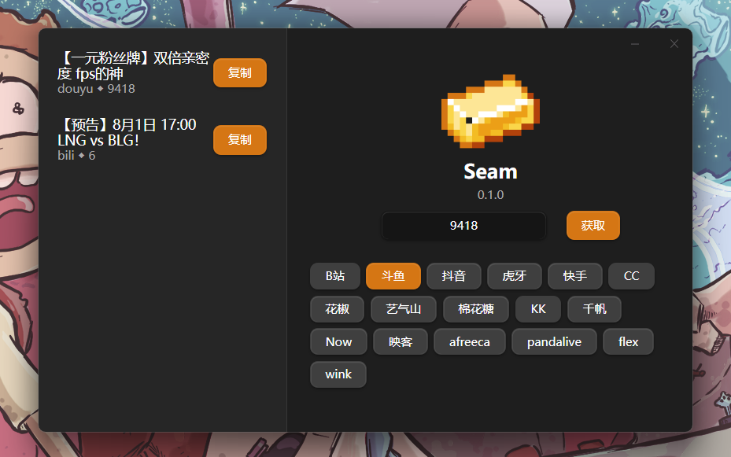

<p align="center">
    
</p>

<h2 align="center">
  Seam
</h2>

<h2 align="center">
  <a href="https://github.com/Borber/seam">
    
  </a>
  <a href="https://github.com/Borber/seam/releases/latest">
    
  </a>
  
</h2>

> 原 `SBtream` 项目, 经历 python 不成熟的模仿, Java 重构烂尾, 目前使用 rust 进行重构开发

多平台直播源地址获取

# 待办

欢迎各位大佬 PR , 积极响应, 友善沟通, 快速 CR, 给您最好的开源体验

-   [ ] cookie 模块
    -   [ ] 完善 cookie 模块
    -   [ ] 添加强制需要 cookie 的平台,其方法上的注释
    -   [ ] 添加对于 global cookie 的支持
-   [ ] 拆分`解析失败错误返回`与`未开播错误`返回
    -   在解析 `api`/`html` 时出错应该返回解析失败, 而不是未开播,以提醒用户, 以便在平台修改了 api 后能够及时修复
-   [ ] GUI action 添加便携版本, 方便已经安装了 WebView2 的用户使用
-   [ ] 添加日志模块, 以便于用户反馈问题

# GUI



## [详情](crates/gui/README.md)

# CLI

```bash
❯ .\seam.exe -l douyu -i 88080
[  {
    "rate": "超清1",
    "url": "http://url1"
  },
  {
    "rate": "超清2",
    "url": "http://url2"
  }
]
```

## [详情](crates/cli/README.md)

# 下载

[Releases · seam](https://github.com/Borber/seam/releases) 下载 `GUI`/`CLI`可执行文件

# 使用

|                 **平台**                  | **子命令** |                             **`<RID>` 位置**                             | **弹幕** | **房间名获取** |
| :---------------------------------------: | :--------: | :----------------------------------------------------------------------: | :------: | :------------: |
|    [B 站](https://live.bilibili.com/)     |    bili    |                    `https://live.bilibili.com/<RID>`                     |    ✅    |       ✅       |
|      [斗鱼](https://www.douyu.com/)       |   douyu    | `https://www.douyu.com/<RID>` 或 `https://www.douyu.com/xx/xx?rid=<RID>` |          |       ✅       |
|     [抖音](https://live.douyin.com/)      |   douyin   |                     `https://live.douyin.com/<RID>`                      |          |                |
|         [虎牙](https://huya.com/)         |    huya    |                         `https://huya.com/<RID>`                         |          |                |
|    [快手](https://live.kuaishou.com/)     |  kuaishou  |                   `https://live.kuaishou.com/u/<RID>`                    |          |                |
|         [CC](https://cc.163.com/)         |     cc     |                        `https://cc.163.com/<RID>`                        |          |                |
|     [花椒](https://www.huajiao.com/)      |  huajiao   |                    `https://www.huajiao.com/l/<RID>`                     |          |       ✅       |
|      [艺气山](https://www.173.com/)       |    yqs     |                       `https://www.173.com/<RID>`                        |          |                |
|      [棉花糖](https://www.2cq.com/)       |    mht     |                       `https://www.2cq.com/<RID>`                        |          |                |
|       [kk](https://www.kktv5.com/)        |     kk     |                    `https://www.kktv5.com/show/<RID>`                    |          |                |
|      [千帆直播](https://qf.56.com/)       |     qf     |                        `https://qf.56.com/<RID>`                         |          |       ✅       |
|      [Now 直播](https://now.qq.com/)      |    now     |            `https://now.qq.com/pcweb/story.html?roomid=<RID>`            |          |                |
|       [映客](https://www.inke.cn/)        |    inke    |           `https://www.inke.cn/liveroom/index.html?uid=<RID>`            |          |       ✅       |
|     [afreeca](https://afreecatv.com/)     |  afreeca   |                     `https://bj.afreecatv.com/<RID>`                     |          |                |
| [pandalive](https://www.pandalive.co.kr/) |   panda    |               `https://www.pandalive.co.kr/channel/<RID>`                |          |                |
|     [flex](https://www.flextv.co.kr/)     |    flex    |                `https://www.flextv.co.kr/channels/<RID>`                 |          |                |
|     [wink](https://www.winktv.co.kr/)     |    wink    |                 `https://www.winktv.co.kr/channel/<RID>`                 |          |                |

# 设置

`config.toml` 放置在 `seam` 可执行文件所在目录下

```toml
# [rid]: 房间号
# [title]: 标题
# [time]: 时间戳
# [date]: 日期

[file_name]
# 录制文件标题
video = "[rid]-[title]-[date]-[time]"
# danmu文件标题
danmu = "[rid]-[title]-[date]-[time]"

# 各平台cookie
[cookie.bili]
cookie = "xxxx"
user-agent = "xxxx"

[cookie.huya]
cookie = "xxxx"
user-agent = "xxxx"
```

# 路线

[seam](https://github.com/users/Borber/projects/4/views/1)

# 相关项目

-   [seamui](https://github.com/kirito41dd/seamui) 由 [kirito41dd](https://github.com/kirito41dd) 开发的`seam`图形化界面
-   [SeamPotPlayer](https://github.com/chen310/SeamPotPlayer/) 由[chen310](https://github.com/chen310) 开发, 直接在 PotPlayer 中调用 seam 播放直播

## 贡献者

[](https://github.com/Borber/seam/graphs/contributors)

# 感谢

-   [wbt5/real-url](https://github.com/wbt5/real-url/)
-   [banner](https://textkool.com/en/ascii-art-generator?hl=default&vl=default&font=Chunky&text=SEAM)
-   [手把手教你破解斗鱼 sign 算法](https://zhuanlan.zhihu.com/p/107330805)

## Star History

<a href="https://github.com/Borber/seam/stargazers">
  <picture>
    <source media="(prefers-color-scheme: dark)" srcset="https://api.star-history.com/svg?repos=Borber/seam&type=Date&theme=dark" />
    <source media="(prefers-color-scheme: light)" srcset="https://api.star-history.com/svg?repos=Borber/seam&type=Date" />
    
  </picture>
</a>
