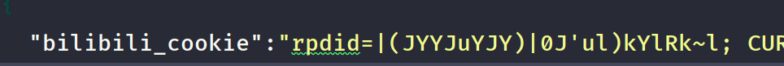
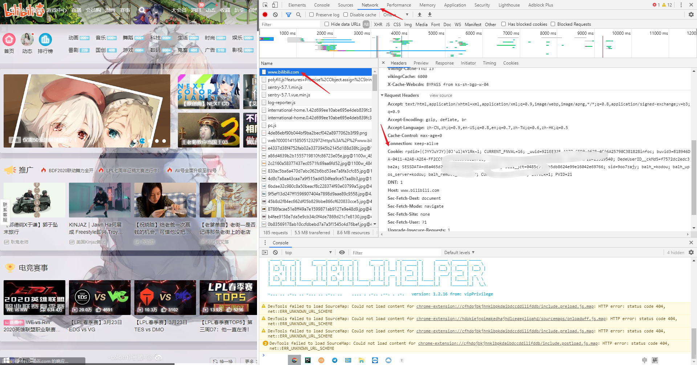
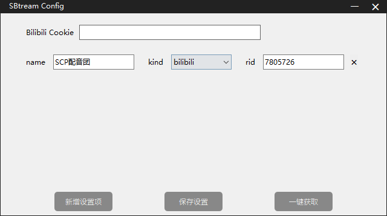
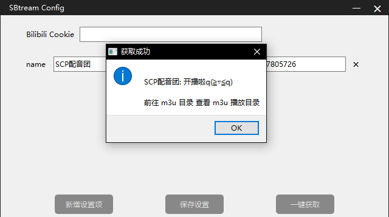
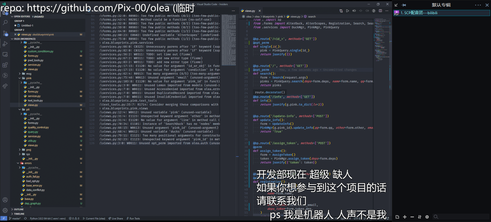
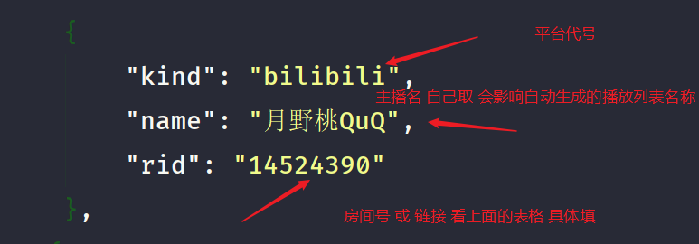
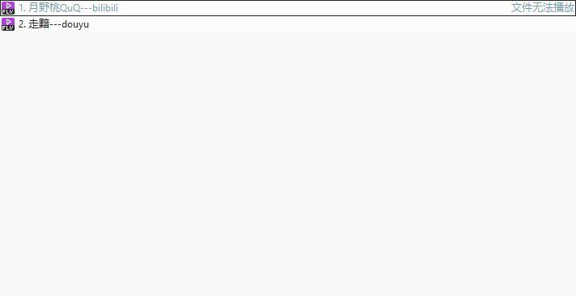
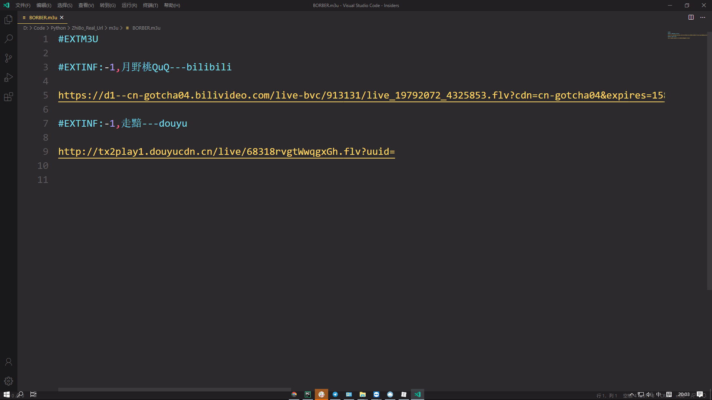

### 一键获取直播平台的真实流媒体地址（直播源），可在PotPlayer、VLC、flv.js等播放器中播放的 m3u 播放列表。 

### SBtream Version 0.0.2-b

#### 基于项目: https://github.com/wbt5/real-url 

###  视频教程: https://www.bilibili.com/video/BV1m74111785

#### 交流群组: https://t.me/SBtream

#### 计划改进:

- [x] 修复 BILIBILI 直播源获取

- [x] 虎牙播放源改至 rtmp 格式

- [x] 升级至虎牙8M播放源

- [x] config 配置 房间号 及名称

- [x]  一键生成所有 config 直播源

- [x]  打包 m3u 直播源播放列表

- [x]  命令行 交互

- [ ]  自动获取直播房间名称 添加至 主播名前(或直接去掉主播名设定 直接爬取)

- [ ] 多线程获取

- [ ]  打包 为可执行文件

- [x]  可视化界面 (注: linux下可能需要修改 frame.py 详情见源码 )

- [x] 可视化添加关注主播 -> config.json

- [x]  可视化批量查询主播是否在播

  

#### 目前有21个直播平台：

斗鱼直播、虎牙直播、哔哩哔哩直播、战旗直播、网易CC直播、火猫直播、企鹅电竞、YY直播、一直播、快手直播、花椒直播、映客直播、西瓜直播、触手直播、NOW直播、抖音直播，爱奇艺直播、酷狗直播、龙珠直播、PPS奇秀直播、六间房。

#### 使用教程:

配置config 于 根目录 config 文件夹 下

##1.如果 软件直接报错 请直接运行 py文件 tMain.py 或者 自己本地 用 pyinstaller 打包一次 即可

1. 直播源:

|     平台     |   代号   |      rid类型       |
| :----------: | :------: | :----------------: |
|   斗鱼直播   |  douyu   |       房间号       |
|   虎牙直播   |   huya   |       房间号       |
| 哔哩哔哩直播 | bilibili |       房间号       |
|   战旗直播   |  zhanqi  |       房间号       |
|  网易CC直播  | wangyicc |       房间号       |
|   火猫直播   |  huomao  |       房间号       |
|   企鹅电竞   |  egame   |       房间号       |
|    YY直播    |    yy    |       房间号       |
|    一直播    | yizhibo  |      房间地址      |
|   快手直播   | kuaishou |       房间号       |
|   花椒直播   | huajiao  |       房间号       |
|   映客直播   |  yingke  |      房间地址      |
|   西瓜直播   |  xigua   |    西瓜直播URL     |
|   触手直播   | chushou  |  触手直播间数字ID  |
|   NOW直播    |   now    |  NOW直播间数字ID   |
|   抖音直播   |  douyin  | 房间号 或 分享链接 |
|  爱奇艺直播  |  iqiyi   |   爱奇艺直播间id   |
|   酷狗直播   |  kugou   |       房间号       |
|   龙珠直播   | longzhu  |       房间号       |
| PPS奇秀直播  |   pps    |       房间号       |
|    六间房    |   v6cn   |    六间房直播ID    |

2. 如果 你想看 哔哩哔哩 直播 请配置 cookie :

   

   请登录你的 bilibili 账号 访问bilibili 的任意网址 然后 按F12 切换到 netwoek  刷新界面 找到一个 确定是 bilibili 的网络请求 然后 复制 request中的 cookie 

   

   

直接下载 release 里的压缩包 解压即可食用 

## 新增图形化界面

 

## 原json配置

配置示例

效果展示:

m3u 文件生成于 根目录下 m3u文件夹中

# 感谢名单

**[CrystalRays](https://github.com/CrystalRays)**  UI界面

